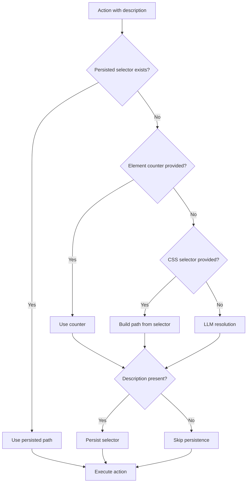

OpenSteer provides a sophisticated selector resolution system that enables deterministic replay of browser automation scripts. By combining description-based targeting with intelligent persistence, your automation scripts become more maintainable and resilient to DOM changes.

## Resolution Process

When you perform an action with a `description` parameter, OpenSteer follows a 5-step resolution process:

1. **Reuse persisted selector** - Check if a selector was previously saved for this description
2. **Snapshot counter** - Use the `element` counter from the current snapshot
3. **Explicit CSS selector** - Use the provided `selector` parameter
4. **LLM resolution** - Ask the configured AI model to locate the element from the description
5. **Actionable error** - Return a detailed error with diagnostic information

<CodeGroup>

```typescript Example
import { Opensteer } from 'opensteer';

const opensteer = new Opensteer({ name: 'my-app' });

await opensteer.launch();
await opensteer.goto('https://example.com');

// Take an action snapshot before interactions
await opensteer.snapshot({ mode: 'action' });

// Use description-based targeting
await opensteer.click({ description: 'login button' });

// The selector is automatically persisted for future runs
```

```typescript First Run
// First run: LLM resolves "login button" to DOM path
await opensteer.click({ description: 'login button' });
// -> Persisted to .opensteer/selectors/my-app/login_button.json
```

```typescript Subsequent Runs
// Second run: Uses persisted selector (no LLM call needed)
await opensteer.click({ description: 'login button' });
// -> Reads from .opensteer/selectors/my-app/login_button.json
```

</CodeGroup>

## Selector Persistence

When OpenSteer successfully resolves an element through steps 2-4 and a `description` is present, the resolved selector path is automatically saved to disk.

### Storage Location

Selectors are stored in `.opensteer/selectors/<namespace>/`:

```
.opensteer/
└── selectors/
    └── my-app/              # Namespace from Opensteer({ name: 'my-app' })
        ├── index.json       # Registry metadata
        ├── login_button.json
        ├── search_field.json
        └── submit_form.json
```

### Selector File Structure

Each persisted selector file contains:

```json
{
  "id": "login_button",
  "method": "click",
  "description": "login button",
  "path": {
    "matches": [
      {
        "tagName": "button",
        "attributes": {
          "id": "login-btn"
        }
      }
    ]
  },
  "metadata": {
    "createdAt": 1234567890000,
    "updatedAt": 1234567890000,
    "sourceUrl": "https://example.com/login"
  }
}
```

<Info>
  The namespace comes from the `name` parameter in `new Opensteer({ name: 'my-app' })`. For CLI usage, use the `--name` flag to set the namespace.
</Info>

## Description-Based Targeting

Description-based targeting allows you to identify elements using natural language rather than brittle CSS selectors or XPath expressions.

### When to Use Descriptions

Use descriptions for:

- **Semantic targeting** - "login button", "search input", "user profile link"
- **Dynamic content** - Elements that may change position but maintain purpose
- **Maintainable scripts** - Scripts that should survive UI refactors
- **AI agent workflows** - Autonomous agents that need reliable element identification

<CodeGroup>

```typescript Actions
// Click actions
await opensteer.click({ description: 'submit button' });

// Input text
await opensteer.input({
  description: 'email address field',
  text: 'user@example.com'
});

// Hover interactions
await opensteer.hover({ description: 'dropdown menu trigger' });

// Select from dropdown
await opensteer.select({
  description: 'country selector',
  value: 'US'
});
```

```typescript Extraction
// Extract structured data
const data = await opensteer.extract({
  description: 'product card',
  schema: {
    title: 'string',
    price: 'string',
    rating: 'number'
  }
});
```

</CodeGroup>

## Deterministic Replay

The persistence system enables deterministic replay, where subsequent runs of the same script use cached selectors instead of making LLM calls.

### Benefits

<CardGroup cols={2}>
  <Card title="Faster Execution" icon="bolt">
    Skip LLM resolution on subsequent runs by reusing persisted selectors
  </Card>
  <Card title="Reduced Costs" icon="dollar-sign">
    Avoid repeated LLM API calls for the same element lookups
  </Card>
  <Card title="Consistency" icon="check">
    Same description always resolves to the same element across runs
  </Card>
  <Card title="Offline Support" icon="wifi-slash">
    Run scripts without LLM access once selectors are cached
  </Card>
</CardGroup>

### Replay Flow



## Fallback Options

While descriptions are powerful, OpenSteer provides explicit fallback options:

<CodeGroup>

```typescript Element Counter
// Use snapshot counter directly
await opensteer.snapshot({ mode: 'action' });
await opensteer.click({ element: 42 });
```

```typescript CSS Selector
// Use explicit CSS selector
await opensteer.click({ selector: '#login-btn' });
```

```typescript Combined Approach
// Combine for maximum reliability
await opensteer.click({
  description: 'login button',  // For persistence
  selector: '#login-btn'         // Fallback if description fails
});
```

</CodeGroup>

## Best Practices

<AccordionGroup>
  <Accordion title="Use consistent namespaces">
    Keep the `name` parameter the same across runs to reuse cached selectors.
    
    ```typescript
    // Good: Consistent namespace
    const opensteer = new Opensteer({ name: 'my-app' });
    ```
  </Accordion>
  
  <Accordion title="Take snapshots before actions">
    Always call `snapshot({ mode: 'action' })` before interactions to ensure fresh element counters.
    
    ```typescript
    await opensteer.snapshot({ mode: 'action' });
    await opensteer.click({ description: 'submit button' });
    ```
  </Accordion>
  
  <Accordion title="Use descriptive descriptions">
    Write clear, semantic descriptions that uniquely identify the target element.
    
    ```typescript
    // Good
    await opensteer.click({ description: 'primary navigation login button' });
    
    // Bad
    await opensteer.click({ description: 'button' });
    ```
  </Accordion>
  
  <Accordion title="Commit selector files to version control">
    Check `.opensteer/selectors/` into git to share cached selectors across team members and CI/CD environments.
    
    ```bash
    git add .opensteer/selectors/
    git commit -m "Add cached selectors for login flow"
    ```
  </Accordion>
</AccordionGroup>

## Related

<CardGroup cols={2}>
  <Card title="Snapshot Modes" href="/concepts/snapshot-modes">
    Learn about different snapshot modes and when to use them
  </Card>
  <Card title="Actions API" href="/api-reference/actions">
    Complete API reference for click, input, hover, and more
  </Card>
</CardGroup>